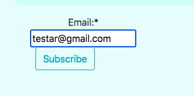
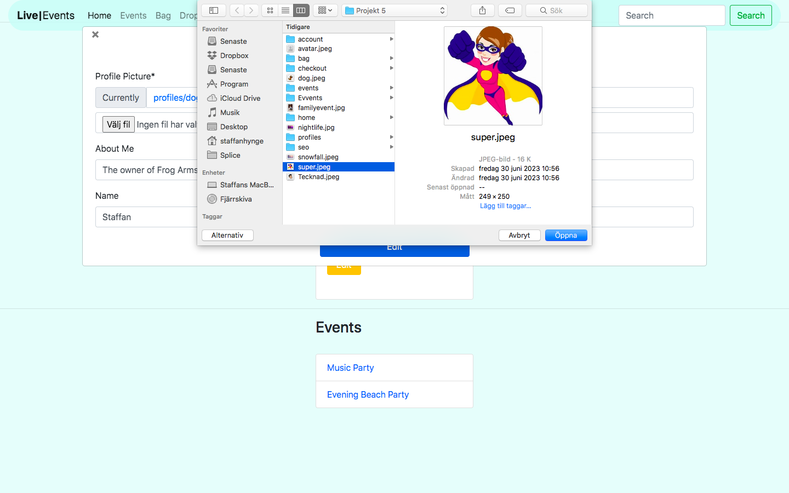
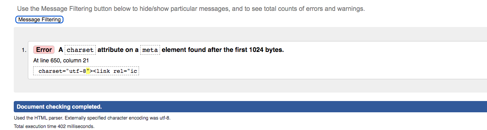

# Live Events

[Here is the livelink](https://live-events-9e71b07dd75e.herokuapp.com/)

Welcome to our event site, where unforgettable experiences await! Whether you're looking for a night of live music, a thrilling sports match, an immersive theater performance, or something in between, we've got you covered. Our site offers a wide variety of events to suit every taste and budget, all in one convenient location. Plus, purchasing tickets is easy and hassle-free, so you can spend less time planning and more time enjoying the excitement of the event. Join us in creating unforgettable memories at the hottest events around we can't wait to see you there!

## Features

- Register an account for the site to login and logout
- Upload your event to the site
- Edit and update your event
- Delete your event
- Buy tickets to events
- Create a profile

## models

I have created 4 models for this project. This is Events and looks like this
| | |
| ------ | ------ |
| user | ForeignKey |
| name | CharField |
| description | CharField |
| price | DecimalField |
| location | CharField |
| date | DateField |
| time | TimeField |
| image | ResizedImagedField |

This is Order and looks like this
| | |
| ------ | ------ |
| order_number | Charfield |
| full_name | CharField
| email | EmailField |
| phone_number | CharField |
| date_now | DateTimeField |
| order_total | DecimalField |

This is OrderItem and looks like this
| | |
| ------ | ------ |
| order | ForeignKey |
| event | ForeignKey
| quantity | IntegerField |
| lineitem_total | DecimalField |

This is Profile and looks like this
| | |
| ------ | ------ |
| user | ForeignKey |
| image | ResizedImageField |
| about | CharField |
| real_name | CharField |

## User Stories

These are the user stories I developed at the start of the project, prioritizing their implementation using the Moscow method.

| Userstories                                                                                                          | Moscow      |
| -------------------------------------------------------------------------------------------------------------------- | ----------- |
| As a site user, I can register an account so that I can have a personal account                                      | Must Have   |
| As a site user, I can login and logout so that I can access my personal information                                  | Must Have   |
| As a Site User I can have a personalized profile so that I can view my orders                                        | Could Have  |
| As a shopper I can view a list of events so that I can select one to purchase tickets to                             | Must Have   |
| As a shopper I can view Individual Eventdetails so that i can identify the details , time and the price of the event | Must Have   |
| As a shopper I can view the total of my purchase so that I can avoid to spend too much money                         | Must Have   |
| As a shopper I can view items in my bag so that I can see all the items I am going to purchase                       | Must Have   |
| As a Shopper I can adjust the quantity in my bag so that I can make changes before I purchase                        | Should Have |
| As a shopper I can easily enter my payment information so that I can checkout quickly                                | Must Have   |
| As a shopper I can search for an event so that I can find a specific event that interests me                         | Should Have |
| As an admin, I can add an event so that new events will be added to the page                                         | Must Have   |
| As an admin, I can edit an event so that I can update the details of the event                                       | Must Have   |
| As an admin, I can delete an event so that I can remove events that are fully booked                                 | Must Have   |
| As an admin I can create a profile so I can see my uploaded events                                                   | Should Have |
| As a user I can search for an event so I can discover new, upcoming events                                           | Could Have  |
| As an admin, I can edit my profile so I can make changes to it                                                       | Should Have |
| As a buyer I can download my order so I can save it on my computer                                                   | Must Have   |

I used Trello during my development because I am used to work on that platform from earlier jobs and projects.

  
Kanban on Trello

  

## SEO

The purpose of my site is to provide small businesses with an easy way to publish their events and reach their target audience. To generate ideas and gauge the search volume and competition of keywords related to events, I used Google Autosearch and Wordtracker. After researching and analyzing the results, I selected the keywords that were most relevant to my site's purpose.

  
Google

  
  

  
Wordtracker

  
  

I decided to use these keywords beacuse they gave me good results and are related to what I want to contribute with on this site.

- Community events Events near me
- Nightlife events Family event
- Upcoming events
- Where to see local bands
- Find tickets for karaoke events
- Get tickets for local bar events
- Cheap event tickets online
- Community events and ticket sales
- local family events near me
- cheap easy event ticket online
- activities and events that parents and kids can enjoy together

This is how I implemented some of these keywords on my site.

Keywords

  
  

It's important to note that since the content on my site will vary depending on the events being showcased, SEO is an ongoing and continuous effort that requires responsiveness to adapting content to match what users are searching for.

## Marketing

As a contributor to various types of musicians and private entrepreneurs, my focus is on helping them reach out to their existing fans and attract new ones. To build a strong foundation, I plan to start locally, leveraging my own network and encouraging users to create their own events tailored to their needs. This will not only drive traffic to my site, but will also generate organic growth over time.

To achieve this goal, I will primarily rely on unpaid social media marketing, utilizing my own contacts to help spread the word and reach a wider audience. This approach will not only be cost-effective, but will also allow for a more personal and authentic connection with users.

By fostering a community of users who are actively creating and attending events through my platform, I can establish the site as a go-to resource for discovering and participating in local events. Over time, this can lead to increased brand recognition, stronger relationships with users, and greater opportunities for monetization and growth.

### Facebook Page

  
Facebook

  
  
  

### Subscribe

  
Subscribe

  
  

I've included links to social media profiles such as Instagram, LinkedIn, and Twitter in the footer of my website. As many of the creators associated with the events I promote use social media as a means of self-promotion, I believe this addition contributes to the content, purpose, and marketing of my site.

## Validation

> PEP8 Validation Service was used to check the code for PEP8 requirements.
> All the code passes with no errors or warnings.

### Home

  
urls.py

  

  
views.py

  

### Events

  
urls.py

  

  
admin.py

  

  
forms.py

  

  
models.py

  

  
views.py

  

### Bag

  
urls.py

  

  
views.py

  

  
context.py

  

### Checkout

  
urls.py

  

  
views.py

  

  
models.py

  

  
forms.py

  

  
admin.py

  

  
signals.py

  

### Profiles

  
urls.py

  

  
views.py

  

  
models.py

  

  
forms.py

  

  
admin.py

  

## Test

### Accounts

  
Signup

  
  

  
Login

  
  

  
Sign Out

  

### Events

  
Create Event

  
  

  
Edit Event

  
  

  
Delete Event

  
  

### Profile

  
Edit Profile

  
  
  

### Payment

  
Payment

  
  
  
  

  
Download

  

## Validation 2

> Lighthouse to check quality and performance of the page.

  
Lighthouse

  
  
  
  
  

> Html Validator was used to check the code for html.
> All the code passes with no errors or warnings except for the the use of jinja templates and a meta tag.

  
Html

  

> Css validator was used to check the code for my css.
> All the code passes with no errors or warnings.

  
CSS

  

## Tech

I used these libraries, frameworks and databases for this project

- Cloudinary
- GitHub
- Django AllAuth
- Pillow
- Psycopg2
- PostgreSQL
- Stripe

## Features to make in The Future

- Save the users bought tickets to their profile
- A list of the pages profiles
- Categorys to the events
- A list of common venues
- A contactpage to contact the profiles
- Email the order and tickets to the buyers

## Credits

> Here are some walkthroughs and videos that inspired and helped me with this project.

- [Django Recipe sharing](https://www.youtube.com/watch?v=LsU79aY79UA&list=PLXuTq6OsqZjbCSfiLNb2f1FOs8viArjWy&index=15)
- [Boutique Ado](https://www.youtube.com/watch?v=3gQazh-EIzY&embeds_referring_euri=https%3A%2F%2Flearn.codeinstitute.net%2F&embeds_referring_origin=https%3A%2F%2Flearn.codeinstitute.net&source_ve_path=NzY3NTg&feature=emb_yt_watermark)

> Here for the css and images

- [Bootstrap for the css](https://getbootstrap.com)
- [Pexels for the images](https://www.pexels.com/)
- [Google font for the fonts](https://fonts.google.com/)
- [Font Awesome for the icons](https://fontawesome.com/)
- [For my favicon](https://favicon.io/favicon-converter/)
