# Live Events

[Here is the livelink](https://live-events-9e71b07dd75e.herokuapp.com/)

Welcome to our event site, where unforgettable experiences await! Whether you're looking for a night of live music, a thrilling sports match, an immersive theater performance, or something in between, we've got you covered. Our site offers a wide variety of events to suit every taste and budget, all in one convenient location. Plus, purchasing tickets is easy and hassle-free, so you can spend less time planning and more time enjoying the excitement of the event. Join us in creating unforgettable memories at the hottest events around we can't wait to see you there!

## Features

- Register an account for the site to login and logout
- Upload your event to the site
- Edit and update your event
- Delete your event
- Buy tickets to events
- Create a profile
- Create, edit and delete a venue
- Contact the site for questions and ideas

## models

I have created 6 models for this project. This is Events and looks like this
| | |
| ------ | ------ |
| user | ForeignKey |
| name | CharField |
| description | CharField |
| price | DecimalField |
| location | CharField |
| date | DateField |
| time | TimeField |
| image | ResizedImagedField |

This is Order and looks like this
| | |
| ------ | ------ |
| order_number | Charfield |
| full_name | CharField
| email | EmailField |
| phone_number | CharField |
| date_now | DateTimeField |
| order_total | DecimalField |

This is OrderItem and looks like this
| | |
| ------ | ------ |
| order | ForeignKey |
| event | ForeignKey
| quantity | IntegerField |
| lineitem_total | DecimalField |

This is Profile and looks like this
| | |
| ------ | ------ |
| user | ForeignKey |
| image | ResizedImageField |
| about | CharField |
| real_name | CharField |

This is Venues and looks like this
| | |
| ------ | ------ |
| user | ForeignKey |
| address | CharField |
| phone_number | CharField |
| home_page | URLField |
| social_media | URLField |
| city | CharField |
| country | CountryField |
| name | CharField |
| image | ResizedImagedField |

This is Contact and looks like this
| | |
| ------ | ------ |
| name | CharField |
| image | EmailField |
| phone_number | CharField |
| Subject | TextField |

Here is an image of the ERD Relationship that I created in DrawSQL

  
Entity Relationship Diagram

  

## User Stories

These are the user stories I developed at the start of the project, prioritizing their implementation using the Moscow method.

| Userstories                                                                                                          | Moscow      |
| -------------------------------------------------------------------------------------------------------------------- | ----------- |
| As a site user, I can register an account so that I can have a personal account                                      | Must Have   |
| As a site user, I can login and logout so that I can access my personal information                                  | Must Have   |
| As a Site User I can have a personalized profile so that I can view my orders                                        | Could Have  |
| As a shopper I can view a list of events so that I can select one to purchase tickets to                             | Must Have   |
| As a shopper I can view Individual Eventdetails so that i can identify the details , time and the price of the event | Must Have   |
| As a shopper I can view the total of my purchase so that I can avoid to spend too much money                         | Must Have   |
| As a shopper I can view items in my bag so that I can see all the items I am going to purchase                       | Must Have   |
| As a Shopper I can adjust the quantity in my bag so that I can make changes before I purchase                        | Should Have |
| As a shopper I can easily enter my payment information so that I can checkout quickly                                | Must Have   |
| As a shopper I can search for an event so that I can find a specific event that interests me                         | Should Have |
| As an admin, I can add an event so that new events will be added to the page                                         | Must Have   |
| As an admin, I can edit an event so that I can update the details of the event                                       | Must Have   |
| As an admin, I can delete an event so that I can remove events that are fully booked                                 | Must Have   |
| As an admin I can create a profile so I can see my uploaded events                                                   | Should Have |
| As a user I can search for an event so I can discover new, upcoming events                                           | Could Have  |
| As an admin, I can edit my profile so I can make changes to it                                                       | Should Have |
| As a buyer I can download my order so I can save it on my computer                                                   | Must Have   |
| As a shopper I can view a list of events so that I can see where the events are held | Must Have |
| As an admin, I can add a venue so that new venues will be added to the page | Must Have |
| As an admin, I can edit a venue so that I can update the details of the venue | Must Have |
| As an admin, I can delete a venue so that I can remove venues that are closed | Must Have |
| As a site user, I can contact the page so that I can share my ideas and questions to the site | Must Have |

I used Trello during my development because I am used to work on that platform from earlier jobs and projects.

  
Kanban on Trello

  

## Sizes

- Small: 320x480
- Medium: 768x1024
- Large: 1280x802
- X-large: 1600x992

### Home

  
Small

  
  
  

  
Medium

  

  
Large

  

  
Xlarge

  

### Events

  
Small

  
  

  
Medium

  
  

  
Large

  
  

  
Xlarge

  
  

### Venues

  
Small

  
  

  
Medium

  

  
Large

  

  
Xlarge

  

### Bag 

  
Small

  
  
  

  
Medium

  
  

  
Large

  

  
Xlarge

  

### Empty Bag

  
Small

  

  
Medium

  

  
Large

  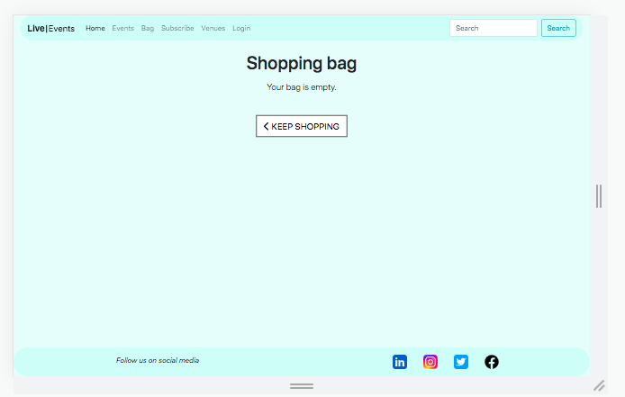

  
Xlarge

  

###  Gallery

  
Small

  
  

  
Medium

  
  

  
Large

  
  

  
Xlarge

  
  

### Subscribe

  
Small

  
  

  

  
Medium

  
  

  

  
Large

  
  

  
Xlarge

  
  

### Login

  
Small

  
  

  

  
Medium

  
  

  

  
Large

  
  

  
Xlarge

  
  

### Logout

  
Small

  
  

  

  
Medium

  
  

  

  
Large

  
  

  
Xlarge

  
  

### Signup

  
Small

  
    
  

  

  
Medium

  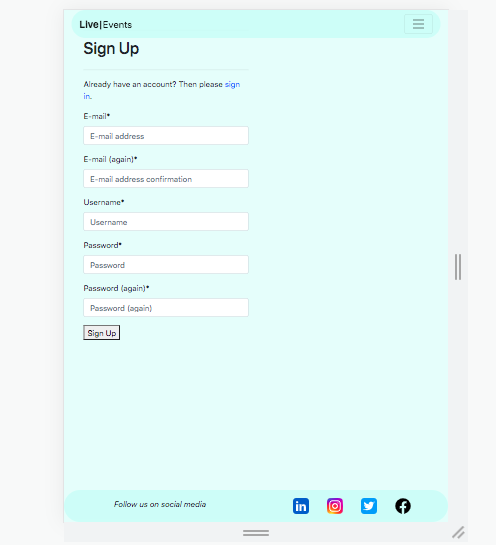
  

  

  
Large

  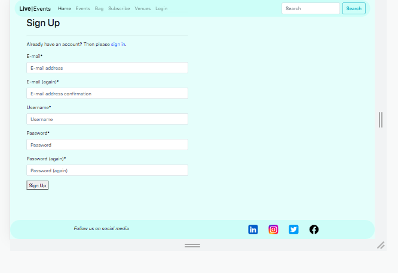
  

  
Xlarge

  
  

  
### Profile

  
Small

  
    
  

  

  
Medium

  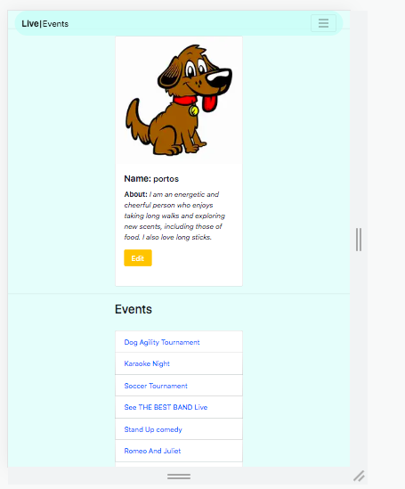
  

  

  
Large

  
  

  
Xlarge

  
  

  ### Create Event

  
Small

  
    
  

  

  
Medium

  
  

  

  
Large

  
  

  
Xlarge

  
  

### Create Venue

  
Small

  
    
  

  

  
Medium

  
  

  

  
Large

  
  

  
Xlarge

  
  

  
### Edit Event

  
Small

  
    
  

  

  
Medium

  
  

  

  
Large

  
  

  
Xlarge

  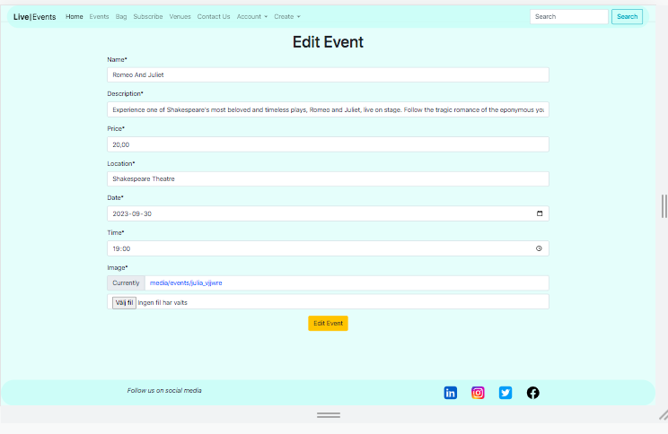
  

### Edit Venue

  
Small

  
    
  

  

  
Medium

  
  

  

  
Large

  
  

  
Xlarge

  
  

  
### Delete Event

  
Small

  
  

  

  
Medium

  
  

  

  
Large

  
  

  
Xlarge

  
  

### Delete Venue

  
Small

  
  

  

  
Medium

  
  

  

  
Large

  
  

  
Xlarge

  
  

### Event Detail

  
Small

  
  
  

  

  
Medium

  
  

  

  
Large

  
    
  

  
Xlarge

 
  
  

### Venue Detail

  
Small

  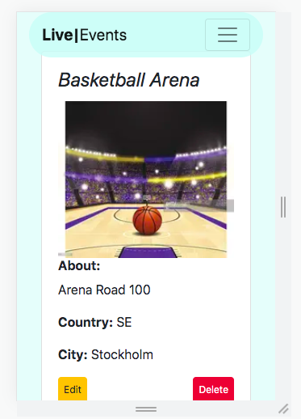
  

  

  
Medium

  
  

  

  
Large

  
  

  
Xlarge

  
  

  ### Checkout

  
Small

  
  
  

  

  
Medium

  
  

  

  
Large

  
  

  
Xlarge

  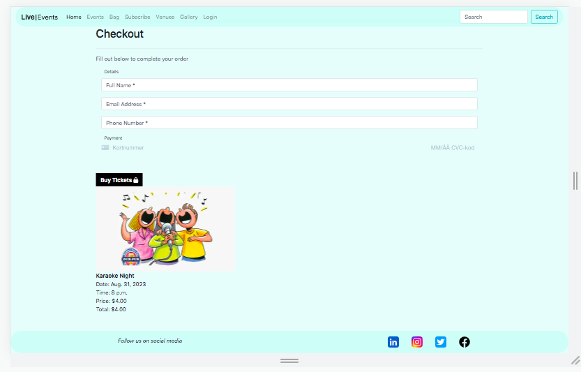
  

  ### Checkout Success

  
Small

  
  

  

  
Medium

  
  

  

  
Large

  
  

  
Xlarge

  
  

  ### 404

  
Small

  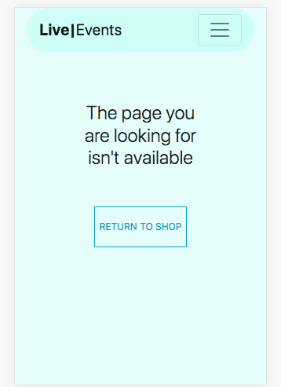
  

  

  
Medium

  
  

  

  
Large

  
  

  
Xlarge

  
  

## Design

- I have chosen to have a footer and a header available all the time because it is important for the visitor to be able to navigate easy all the time. I have chosen words on the header to easy describe what the links do and go to so the user easy can understand and icons for my socialmedia because the icons are well known and designed well.  
- For my homepage I have chosen to use images to describe what the page are for and I think the images are beautiful and fits well on my page. 
- The event/venue/bag pages uses card attributes for the items because it packages the information well and makes the layout easy to follow on both small and large screen sizes. 
- I have a minmal approach on my site because I want only the keywords and the information to be easy to see and understand. 
- My color is light blue/turqouise because I want to have a light visual on my site because that is what I like myself and I wanted to have a background that I personally have not seen before to make the page stand out compared to others.
- I chose a font that is easy to read, with a friendly and inviting shape, ensuring clarity and creating a visually appealing experience for visitors
  
## SEO

The purpose of my site is to provide small businesses with an easy way to publish their events and reach their target audience. To generate ideas and gauge the search volume and competition of keywords related to events, I used Google Autosearch and Wordtracker. After researching and analyzing the results, I selected the keywords that were most relevant to my site's purpose.

  
Google

  
  

  
Wordtracker

  
  

I decided to use these keywords beacuse they gave me good results and are related to what I want to contribute with on this site.

- Community events Events near me
- Nightlife events Family event
- Upcoming events
- Where to see local bands
- Find tickets for karaoke events
- Get tickets for local bar events
- Cheap event tickets online
- Community events and ticket sales
- local family events near me
- cheap easy event ticket online
- activities and events that parents and kids can enjoy together

This is how I implemented some of these keywords on my site.

Keywords

  
  

It's important to note that since the content on my site will vary depending on the events being showcased, SEO is an ongoing and continuous effort that requires responsiveness to adapting content to match what users are searching for.

### Marketing
I creates three different avatars so I could learn to know some of my target auddiences and approach them in a good way

#### Avatar 1 Young Professional/Student

  - Location: Lives in a small city
  - Age: 18-25
  - Career: Studies/Young Professional
  - Family: None
  - Motivation to buy: Wants to have fun times with friends
  - Buying concerns: Limited budget, needs to save money for events
- Media: Social Media, YouTube
- Approach: For this avatar, organic social media marketing would be effective. Focus on creating engaging content such as short videos and images showcasing your events. Advertise the event well in advance and offer packages like early bird tickets to incentivize early purchases. Utilize platforms like Facebook, Instagram, and YouTube to reach this audience.

#### Avatar 2 Wife with 2 kids
- Lives in a medium-sized city
- Age: 35-40
- Career: Teacher
- Family: Parents to kids who are 7-12 years old
- Motivation to buy: Wants to spend time and activities with their family
- Buying concerns: Limited budget due to family and household expenses
- Media: Instagram, News sites, Clothes sites, Facebook, Television
- Approach: Display marketing banners on relevant websites such as news sites and clothes sites, with a clear call to action. Target parents with engaging visuals and messaging that highlights the family-friendly nature of our events. Utilize platforms like Instagram, Facebook, and television advertising to reach this audience.

#### Avatar 3 Music Enthusiast
- Location: Lives in a large city
- Age: 55-60
- Career: Scrum Master in a tech company
- Family: Wife and adult kids
- Motivation to buy: Interested in music and has a collection of vinyl records
- Buying concerns: Picky about choices, seeks the best experiences
- Media: Facebook, News sites, Television
- Approach: Paid search marketing would be effective for this avatar. Create targeted ads that appear on platforms like Facebook and news sites, focusing on the music aspect of our events. Highlight unique experiences and the quality of the performances. Consider partnering with local record stores or music blogs to reach this audience.

### Facebook Page

  
Facebook

  
  
  

### Subscribe

  
Subscribe

  
  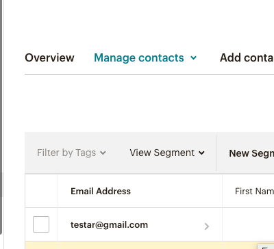

I've included links to social media profiles such as Instagram, LinkedIn, and Twitter in the footer of my website. As many of the creators associated with the events I promote use social media as a means of self-promotion, I believe this addition contributes to the content, purpose, and marketing of my site.

## Validation

> PEP8 Validation Service was used to check the code for PEP8 requirements.
> All the code passes with no errors or warnings.

### Home

  
urls.py

  

  
views.py

  

### Events

  
urls.py

  

  
admin.py

  

  
forms.py

  

  
models.py

  

  
views.py

  

### Bag

  
urls.py

  

  
views.py

  

  
context.py

  

### Checkout

  
urls.py

  

  
views.py

  

  
models.py

  

  
forms.py

  

  
admin.py

  

  
signals.py

  

### Profiles

  
urls.py

  

  
views.py

  

  
models.py

  

  
forms.py

  

  
admin.py

  

### Venues

  
urls.py

  

  
views.py

  

  
models.py

  

  
forms.py

  

### Contact

  
urls.py

  

  
views.py

  

  
models.py

  

  
forms.py

  

## Test

### Accounts

  
Signup

  
  

  
Login

  
  

  
Sign Out

  

### Events

  
Create Event

  
  

  
Edit Event

  
  

  
Delete Event

  
  

### Profile

  
Edit Profile

  
  
  

### Payment

  
Payment

  
  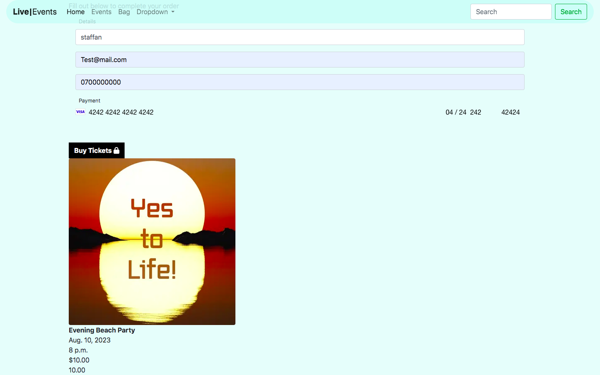
  
  

  
Download

  

### Venues

  
Create

  
  

  
Edit

  
  
  

  
Delete

  
  
  

### Contact Form

  
Contact us

  
  

### External links

  
Linkedin

  
  

  
Instagram

  
  

  
Twitter/X

  
  

  
Facebook

  
  

### Navigation links

  
Home

  
  

  
Events

  
  

  
Bag

  
  
  

  
Subscribe

  
  

  
Venues

  
  

  
Contact Us

  
  

  
Profile

  
  

  
New Event

  
  

  
New venue

  
  

### Header

  
Header when you are a superuser

  

  
Header when you are logged in

  

  
Header when you are logged out

  

### Security

  
When you are logged out and try to go to the create page for events and venues

  
  
  
  

  
When you are logged out and try to go to the edit page for events and venues

  
  
  
  

  
When you are logged out and try to go to the delete page for events and venues

  
  
  
  

  
When you are write something that is not a correct url you get redirected to a 404 page

  

## Validation 2

> Lighthouse to check quality and performance of the page.

  
Lighthouse

  
  
  
  
  

> Html Validator was used to check the code for html.
> All the code passes with no errors or warnings except for 2 warnings.
> The type attribute is not neccessary in a script tag
> An alt tag is missing when you choose a flag because of django countries

  
home

  

  
Events

  

  
Create Event

  

  
Edit Event

  

  
Delete Event

  

  
Event Detail

  

  
Venues

  

  
Create Venue

  

  
Edit Venue

  

  
Delete Venue

  

  
Venue Detail

  

  
Bag

  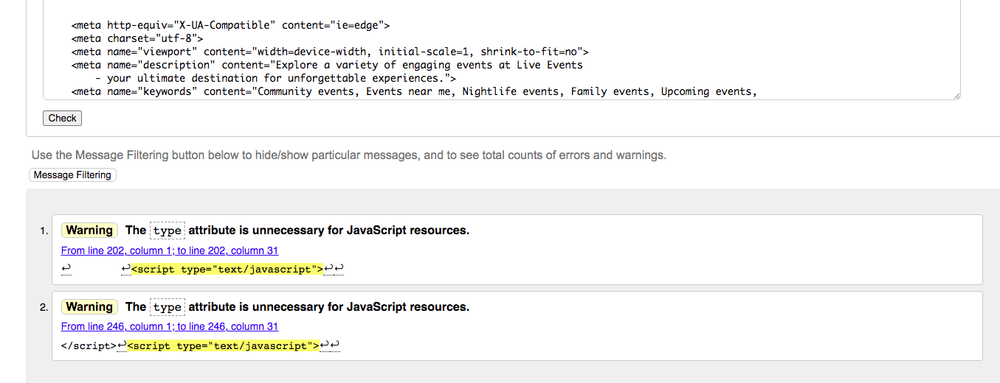

  
Subscribe

  

  
Contact Us

  

  
Profile

  

  
Login

  

  
Logout

  

  
Sign Up

  

  
Gallery

  

  
checkout

  

  
404

  

> Css validator was used to check the code for my css.
> All the code passes with no errors or warnings.

  
CSS

  

## Tech

I used these libraries, frameworks and databases for this project

- Cloudinary
- GitHub
- Django AllAuth
- Pillow
- Psycopg2
- PostgreSQL
- Stripe
- Django: receiver
- Django: ResizedImageField
- Django: CountryField
- crispy_forms
- Django: User
- Django: post_save
- Heroku
- Code anywhere

## Features to make in The Future

- Save the users bought tickets to their profile
- A list of the pages profiles
- Categorys to the events
- A list of common venues
- A contactpage to contact the profiles
- Email the order and tickets to the buyers

## Deployment

- I have the repository for the page on github.com
- I set up all my secret keys in my env.py and put my env.py in my .gitignore to keep them hidden
- My secret keys include django_secretKey, database_url and cloudinary_url
- set up my debug in my env.py so that debug is true during production and false when it is live
- I freezed all my requirements before I added, commited and pushed everything on Github
- created an app on Heroku called Live Events
- Configured my Config vars on Heroku which includes Database_url, Cloudinary_url, Secret_key, Stripe_pk, Stripe_sk and a port of 8000
- Set up disablecollectstaic for my first Deployment
- Connect Heroku to my repository on github
- Deployed my project manually

## Credits

> Here are some walkthroughs and videos that inspired and helped me with this project.

- [Django Recipe sharing](https://www.youtube.com/watch?v=LsU79aY79UA&list=PLXuTq6OsqZjbCSfiLNb2f1FOs8viArjWy&index=15)
- [Boutique Ado](https://www.youtube.com/watch?v=3gQazh-EIzY&embeds_referring_euri=https%3A%2F%2Flearn.codeinstitute.net%2F&embeds_referring_origin=https%3A%2F%2Flearn.codeinstitute.net&source_ve_path=NzY3NTg&feature=emb_yt_watermark)

> Here for the css and images

- [Bootstrap for the css](https://getbootstrap.com)
- [Pexels for the images](https://www.pexels.com/)
- [Google font for the fonts](https://fonts.google.com/)
- [Font Awesome for the icons](https://fontawesome.com/)
- [For my favicon](https://favicon.io/favicon-converter/)
