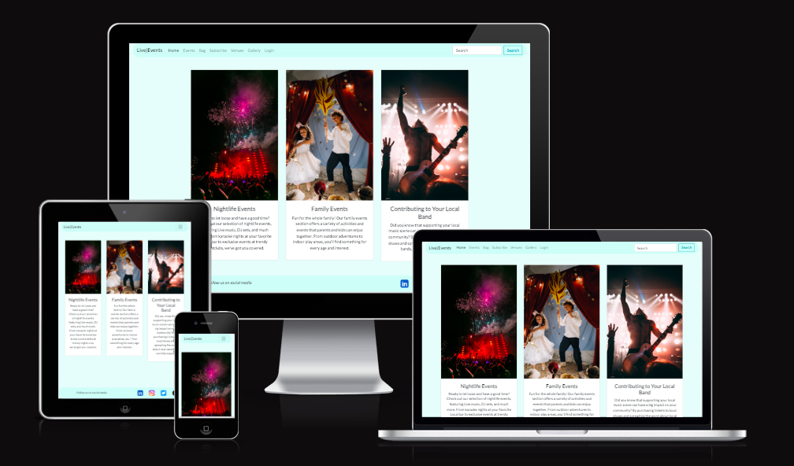
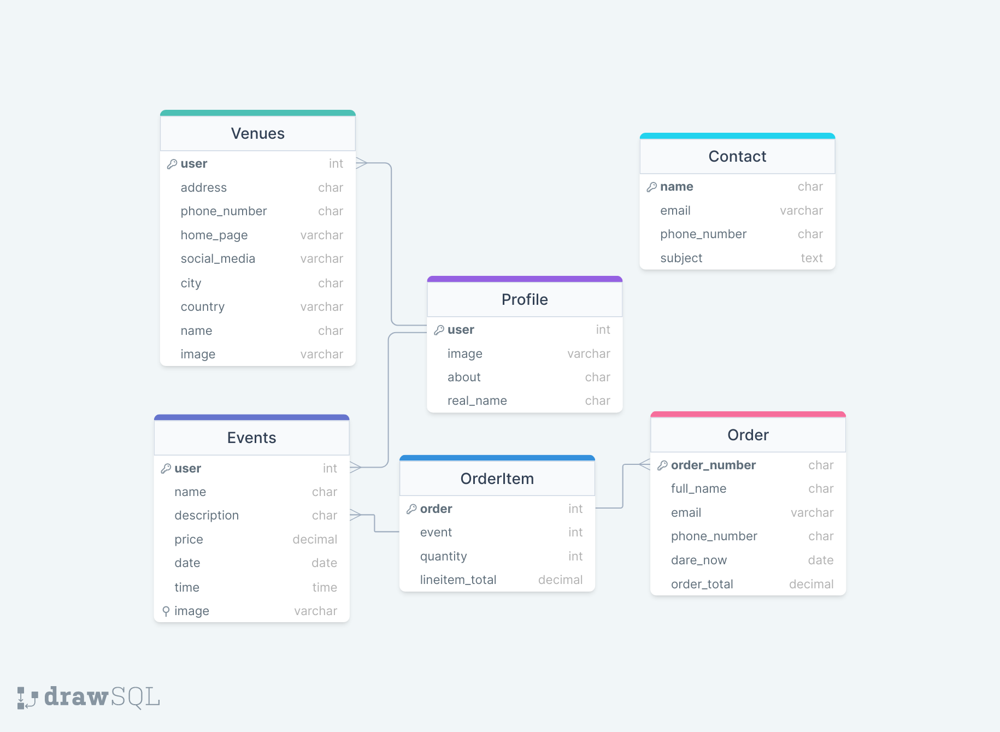
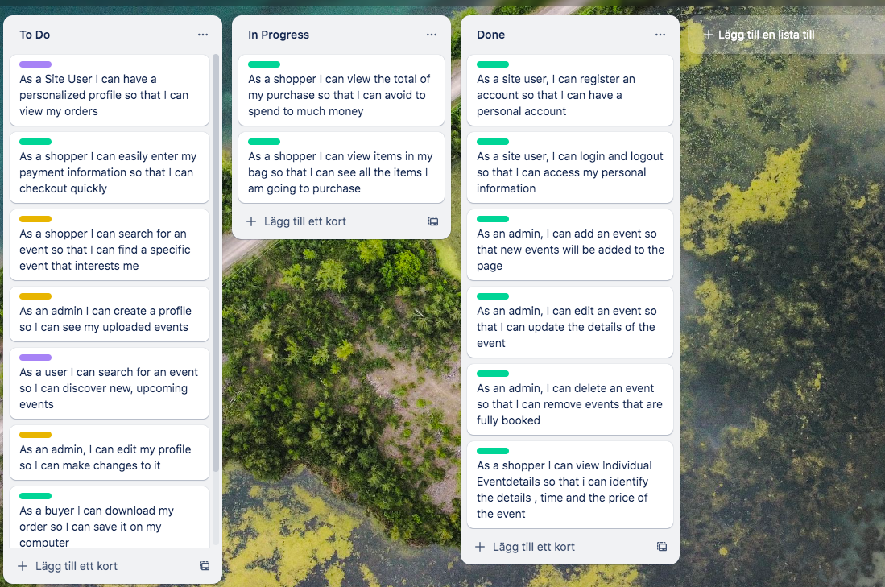

# Live Events

[Here is the livelink](https://live-events-9e71b07dd75e.herokuapp.com/)

Welcome to our event site, where unforgettable experiences await! Whether you're looking for a night of live music, a thrilling sports match, an immersive theater performance, or something in between, we've got you covered. Our site offers a wide variety of events to suit every taste and budget, all in one convenient location. Plus, purchasing tickets is easy and hassle-free, so you can spend less time planning and more time enjoying the excitement of the event. Join us in creating unforgettable memories at the hottest events around we can't wait to see you there!

Due to the README file previously only showing the first 200 lines of the document, I have broken the larger sections out into their own files, for which I have provided links in the Table of Contents.



# Table of Contents
- [Live Events](#live-events)
- [Table of Contents](#table-of-contents)
  - [Models](#models)
  - [User Stories](#user-stories)
  - [Design](#design)
    - [Colour palette](#colour-palette)
    - [Font](#font)
  - [Tech](#tech)
    - [Features to make in The Future](#features-to-make-in-the-future)
  - [Deployment](#deployment)
    - [Set up Workspace](#set-up-workspace)
    - [Create an Heroku app](#create-an-heroku-app)
    - [Set up Settings.py](#set-up-settingspy)
    - [Final Deployment](#final-deployment)
  - [Credits](#credits)
  - [Sizes](#sizes)
  - [Marketing \& SEO](#marketing--seo)
  - [Testing](#testing)

## Models

I have created 6 models for this project. This is Events and looks like this
| | |
| ------ | ------ |
| user | ForeignKey |
| name | CharField |
| description | CharField |
| price | DecimalField |
| location | CharField |
| date | DateField |
| time | TimeField |
| image | ResizedImagedField |

This is Order and looks like this
| | |
| ------ | ------ |
| order_number | Charfield |
| full_name | CharField
| email | EmailField |
| phone_number | CharField |
| date_now | DateTimeField |
| order_total | DecimalField |

This is OrderItem and looks like this
| | |
| ------ | ------ |
| order | ForeignKey |
| event | ForeignKey
| quantity | IntegerField |
| lineitem_total | DecimalField |

This is Profile and looks like this
| | |
| ------ | ------ |
| user | ForeignKey |
| image | ResizedImageField |
| about | CharField |
| real_name | CharField |

This is Venues and looks like this
| | |
| ------ | ------ |
| user | ForeignKey |
| address | CharField |
| phone_number | CharField |
| home_page | URLField |
| social_media | URLField |
| city | CharField |
| country | CountryField |
| name | CharField |
| image | ResizedImagedField |

This is Contact and looks like this
| | |
| ------ | ------ |
| name | CharField |
| image | EmailField |
| phone_number | CharField |
| Subject | TextField |

Here is an image of the ERD Relationship that I created in DrawSQL

<details>
  <summary>Entity Relationship Diagram</summary>
  
</details>

## User Stories

These are the user stories I developed at the start of the project, prioritizing their implementation using the Moscow method.

| Userstories                                                                                                          | Moscow      |
| -------------------------------------------------------------------------------------------------------------------- | ----------- |
| As a site user, I can register an account so that I can have a personal account                                      | Must Have   |
| As a site user, I can login and logout so that I can access my personal information                                  | Must Have   |
| As a Site User I can have a personalized profile so that I can view my orders                                        | Could Have  |
| As a shopper I can view a list of events so that I can select one to purchase tickets to                             | Must Have   |
| As a shopper I can view Individual Eventdetails so that i can identify the details , time and the price of the event | Must Have   |
| As a shopper I can view the total of my purchase so that I can avoid to spend too much money                         | Must Have   |
| As a shopper I can view items in my bag so that I can see all the items I am going to purchase                       | Must Have   |
| As a Shopper I can adjust the quantity in my bag so that I can make changes before I purchase                        | Should Have |
| As a shopper I can easily enter my payment information so that I can checkout quickly                                | Must Have   |
| As a shopper I can search for an event so that I can find a specific event that interests me                         | Should Have |
| As an admin, I can add an event so that new events will be added to the page                                         | Must Have   |
| As an admin, I can edit an event so that I can update the details of the event                                       | Must Have   |
| As an admin, I can delete an event so that I can remove events that are fully booked                                 | Must Have   |
| As an admin I can create a profile so I can see my uploaded events                                                   | Should Have |
| As a user I can search for an event so I can discover new, upcoming events                                           | Could Have  |
| As an admin, I can edit my profile so I can make changes to it                                                       | Should Have |
| As a buyer I can download my order so I can save it on my computer                                                   | Must Have   |
| As a shopper I can view a list of events so that I can see where the events are held | Must Have |
| As an admin, I can add a venue so that new venues will be added to the page | Must Have |
| As an admin, I can edit a venue so that I can update the details of the venue | Must Have |
| As an admin, I can delete a venue so that I can remove venues that are closed | Must Have |
| As a site user, I can contact the page so that I can share my ideas and questions to the site | Must Have |


I used Trello during my development because I am used to work on that platform from earlier jobs and projects.

<details>
  <summary>Kanban on Trello</summary>
  
</details>
(<a href="https://trello.com/invite/b/CFFFopJa/ATTI4453f69c2f3d785a622b6f82ba2ae07fCA1C479D/live-events">Link to Trello</a>)


## Design

- I have chosen to have a footer and a header available all the time because it is important for the visitor to be able to navigate easy all the time. I have chosen words on the header to easy describe what the links do and go to so the user easy can understand and icons for my socialmedia because the icons are well known and designed well.  
- For my homepage I have chosen to use images to describe what the page are for and I think the images are beautiful and fits well on my page. 
- The event/venue/bag pages uses card attributes for the items because it packages the information well and makes the layout easy to follow on both small and large screen sizes. 
- I have a minmal approach on my site because I want only the keywords and the information to be easy to see and understand. 

### Colour palette
- My color is light blue/turqouise because I want to have a light visual on my site because that is what I like myself and I wanted to have a background that I personally have not seen before to make the page stand out compared to others.
These are the colors I mainly have on my website. 

- hsla(173, 84%, 90%, 0.786) - #7BD6E6.:
This color is a shade of blue with a hue of 173 degrees, saturation of 84%, lightness of 90%, and an alpha value of 0.786. It has a slightly transparent appearance, allowing the underlying elements to show through to some extent. This color can be used to create a calming and refreshing atmosphere.
- hsla(173, 84%, 90%, 0.45) - #B3E1E1 : 
This color is similar to the previous one, but with a lower alpha value of 0.45. It has the same hue, saturation, and lightness values, but it is more transparent. This color can be used to create subtle overlays or gradients, adding depth and visual interest.

- White -  #FFF: 
White is a classic and versatile color that represents purity, simplicity, and cleanliness. It can be used as a background color to create a minimalist and modern look, allowing other elements on your website to stand out. White also provides a sense of spaciousness and can enhance readability.

- Black -  #000: Black is a strong and powerful color that represents elegance, sophistication, and authority. It can be used as a text color or as a background color to create high contrast and make other elements pop.

(<a href="pictures/colorpalette.png">Colors</a>)

### Font 
- I chose Lato as a font that is easy to read, clean and modern, ensuring clarity and creating a visually appealing experience for the visitors.


## Tech

I used these libraries, frameworks and databases for this project

- Cloudinary - To host images
- GitHub - To store my repository
- Django AllAuth - Authentication library for user authentication
- Pillow - To process images
- Psycopg2 - To connect to a PostgreSQL database 
- PostgreSQL - For my database
- Stripe - To handle payments
- Django: ResizedImageField - To resize images
- Django: CountryField - To select country
- crispy_forms - To render forms
- Django: User - To represent a user account
- Heroku - To deploy the page and make it publicly available
- Code anywhere - As my workspace

### Features to make in The Future

- Save the users bought tickets to their profile
- A list of the pages profiles
- Categorys to the events
- A list of common venues
- A contactpage to contact the profiles
- Email the order and tickets to the buyers

## Deployment

### Set up Workspace
1. Install gunicorn:
    * ```pip install gunicorn```
2.  Install supporting libraries:
    * ```pip install dj_database_url```
    * ```pip install psycopg2-binary```
    * ```pip install dj3-cloudinary-storage```
3. Set up all my secret keys in my env.py and put my env.py in my .gitignore to keep them hidden.
    The Secret keys are:
    * ``` os.environ["SECRET_KEY"] = " Your Secret Key "```
    * ```os.environ["CLOUDINARY_URL"] = "cloudinary://cloudinary_url"```
    * ```os.environ["DATABASE_URL"] = postgres://database_url```
    * ```os.environ["DEVELOPMENT"] = "True"```
4. Create a Procfile.
    Add this code in the Procfile:
    *```web: gunicorn live.wsgi:application```
5.  Freeze requirements to create a local file so that heroku know which packages to install
     *```pip3 freeze > requirements.txt```

### Create an Heroku app
1. Create a new Heroku app:
    * Click "New" in the top right-hand corner of the landing page, then click "Create new app."
2. Give the app a unique name:
    * Will form part of the URL
3. Select the nearest location:
    * For me, this was Europe.
4. Configure Config vars on Heroku
   * Database_url: Your databaseurl
   * Cloudinary_url: Your Cloudinary url
   * Secret_key: Your Secret Key
   * Stripe_pk: Stripes public key
   * Stripe_pk: Stripes secret key
   * Port: 8000
   * disablecollectstatic: 1

### Set up Settings.py
1. At the top of your settings.py 
```python
import os
import dj_database_url
from pathlib import Path

if os.path.exists('env.py'):
    import env

SECRET_KEY = os.environ.get('SECRET_KEY')
DEBUG = 'DEVELOPMENT' in os.environ
```
2. Add your heroku app name in allowed hosts
 ```python
 ALLOWED_HOSTS = ['project_name.herokuapp.com']
 ```
 3. Add a conditional in setting.py DATABASES section by replacing it with the following snippet to link up the Heroku Postgres server when in production and SQLite3 when developing locally:
```python
if 'DATABASE_URL' in os.environ:
    DATABASES = {
        'default': dj_database_url.parse(os.environ.get('DATABASE_URL'))
    }
else:

    DATABASES = {
        'default': {
            'ENGINE': 'django.db.backends.sqlite3',
            'NAME': os.path.join(BASE_DIR, 'db.sqlite3'),
        }
    }
```
4. Tell Django to where to store media and static files by placing this snippet under the comments indicated below:
```python
STATIC_URL = '/static/'
STATICFILES_DIRS = (os.path.join(BASE_DIR, 'static'),)
STATICFILES_STORAGE = 'cloudinary_storage.storage.StaticHashedCloudinaryStorage'

MEDIA_URL = '/media/'
MEDIA_ROOT = os.path.join(BASE_DIR, 'media')
DEFAULT_FILE_STORAGE = 'cloudinary_storage.storage.MediaCloudinaryStorage'
```

### Final Deployment
1. Make a final commit and push the code to the GitHub Repository.
*```git add . ```
*```git commit -m "final deployment"```
*```git push```
2. Remove disablecollectstacic from config vars on Heroku
3. Press Deploy

## Credits

> Here are some walkthroughs and videos that inspired and helped me with this project.

- [Django Recipe sharing](https://www.youtube.com/watch?v=LsU79aY79UA&list=PLXuTq6OsqZjbCSfiLNb2f1FOs8viArjWy&index=15)
- [Boutique Ado](https://www.youtube.com/watch?v=3gQazh-EIzY&embeds_referring_euri=https%3A%2F%2Flearn.codeinstitute.net%2F&embeds_referring_origin=https%3A%2F%2Flearn.codeinstitute.net&source_ve_path=NzY3NTg&feature=emb_yt_watermark)

> Here for the css and images

- [Bootstrap for the css](https://getbootstrap.com)
- [Pexels for the images](https://www.pexels.com/)
- [Google font for the fonts](https://fonts.google.com/)
- [Font Awesome for the icons](https://fontawesome.com/)
- [For my favicon](https://favicon.io/favicon-converter/)

## Sizes 
[See Sizes Here](sizes.md)

## Marketing & SEO
[See Marketing Here](marketing.md)

## Testing
[See Testing Here](test.md)

[Back to Top](#table-of-contents)
