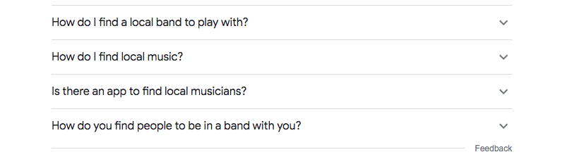
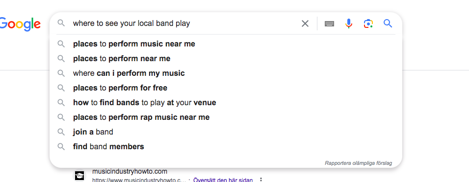
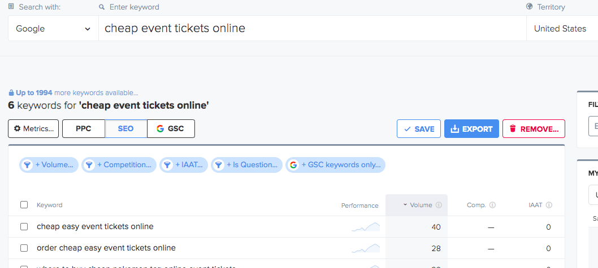
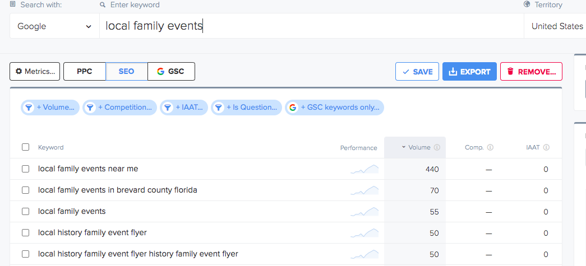
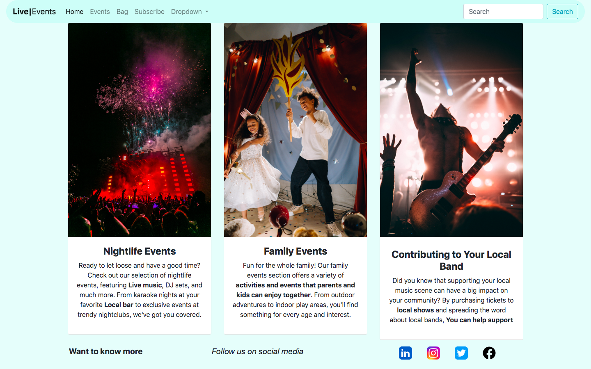
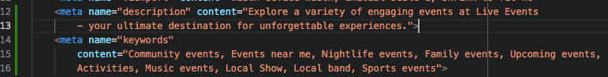
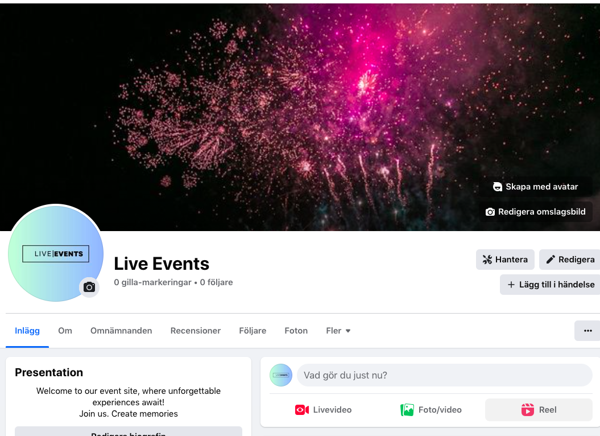
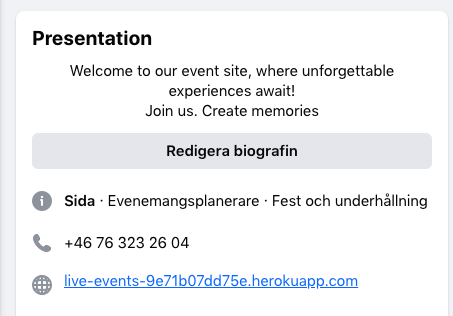
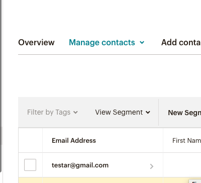

# Table Of Contents
- [Table Of Contents](#table-of-contents)
  - [SEO](#seo)
  - [Keywords](#keywords)
    - [Business Model](#business-model)
    - [Marketing](#marketing)
      - [Avatar 1 Young Professional/Student](#avatar-1-young-professionalstudent)
      - [Avatar 2 Wife with 2 kids](#avatar-2-wife-with-2-kids)
      - [Avatar 3 Music Enthusiast](#avatar-3-music-enthusiast)
    - [Summary](#summary)
    - [Facebook Page](#facebook-page)
    - [Subscribe](#subscribe)

## SEO

The purpose of my site is to provide small businesses with an easy way to publish their events and reach their target audience. To generate ideas and gauge the search volume and competition of keywords related to events, I used Google Autosearch and Wordtracker. After researching and analyzing the results, I selected the keywords that were most relevant to my site's purpose.

  
Google

  
  

  
Wordtracker

  
  

## Keywords

I decided to use these keywords because they gave me good results and are related to what I want to contribute with on this site.

- Community events Events near me
- Nightlife events Family event
- Upcoming events
- Where to see local bands
- Find tickets for karaoke events
- Get tickets for local bar events
- Cheap event tickets online
- Community events and ticket sales
- local family events near me
- cheap easy event ticket online
- activities and events that parents and kids can enjoy together

This is how I implemented some of these keywords on my site.

Keywords

  
  

It's important to note that since the content on my site will vary depending on the events being showcased, SEO is an ongoing and continuous effort that requires responsiveness to adapting content to match what users are searching for.

### Business Model
My business model is B2C(business to customer)

### Marketing
I created three different avatars so I could learn to know some of my target auddiences and approach them in a good way

#### Avatar 1 Young Professional/Student

- Location: Lives in a small city
- Age: 18-25
- Career: Studies/Young Professional
- Family: None
- Motivation to buy: Wants to have fun times with friends
- Buying concerns: Limited budget, needs to save money for events
- Media: Social Media, YouTube
- Approach: For this avatar, organic social media marketing would be effective. Focus on creating engaging content such as short videos and images showcasing our events. Advertise the event well in advance and offer packages like early bird tickets to incentivize early purchases. Utilize platforms like Facebook, Instagram, and YouTube to reach this audience.
- Strategy: Utilize organic social media marketing to engage with the target audience.

#### Avatar 2 Wife with 2 kids

- Lives in a medium-sized city
- Age: 35-40
- Career: Teacher
- Family: Parents to kids who are 7-12 years old
- Motivation to buy: Wants to spend time and activities with their family
- Buying concerns: Limited budget due to family and household expenses
- Media: Instagram, News sites, Clothes sites, Facebook, Television
- Approach: Display marketing banners on relevant websites such as news sites and clothes sites, with a clear call to action. Target parents with engaging visuals and messaging that highlights the family-friendly nature of our events. Utilize platforms like Instagram, Facebook, and television advertising to reach this audience.
- Strategy: Implement display marketing on relevant websites and utilize social media and television advertising.

#### Avatar 3 Music Enthusiast
- Location: Lives in a large city
- Age: 55-60
- Career: Scrum Master in a tech company
- Family: Wife and adult kids
- Motivation to buy: Interested in music and has a collection of vinyl records
- Buying concerns: Picky about choices, seeks the best experiences
- Media: Facebook, News sites, Television
- Approach: Paid search marketing would be effective for this avatar. Create targeted ads that appear on platforms like Facebook and news sites, focusing on the music aspect of our events. Highlight unique experiences and the quality of the performances. Consider partnering with local record stores or music blogs to reach this audience.
- Strategy: Employ paid search marketing to target the audience interested in music.

### Summary

To effectively reach the three avatars, a combination of organic social media marketing, display marketing, and paid search marketing should be implemented.
This means that I will create content on Social media sites that focuses on the music aspect of our events. This will affect avatars 1 and 3 and that is what I choose to prioritize to get in contact with these target audiences. 
We will also display banners on clothes and newssites to target avatar 2.
The use of Email marketing is also implemented to advertise how and why our customers should join our events. 

With these strategies the marketing will promote and inform these audiences I have choosen to prioritize.

### Facebook Page

  
Facebook

  
  
  

### Subscribe

  
Subscribe

  
  

I've included links to social media profiles such as Facebook, Instagram, LinkedIn, and Twitter in the footer of my website. As many of the creators associated with the events I promote use social media as a means of self-promotion, I believe this addition contributes to the content, purpose, and marketing of my site.

[Back to Top](#table-of-contents)
